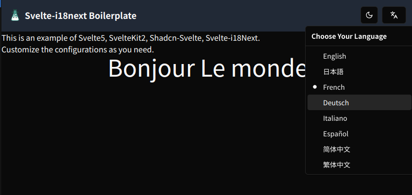

# Svelte 5 + SvelteKit 2 + Shadcn-Svelte@next + Svelte-i18next

This boilerplate is for web developers who need to implement multi-languages.

In this boilerplate I use [svelte-i18next](https://www.npmjs.com/package/svelte-i18next) one of the best implementation for muti-language internationalizaion.

## Why I did not use Paragride

I have tried some, such as [inlang Paragride-SvelteKit](https://inlang.com/m/dxnzrydw/paraglide-sveltekit-i18n) however I already get used to i18n-React so I would not like to use "internationalized Routing" architecture.

1. internationalized Routing

If you have several languages, en, de, es etc, when you change the language using Paragride, it will automatically served as follows:

- /en/about
- /de/about
- /es/about

The address will be automatically redirected above. This solution is in some case really useful, but I would rather use word-by-word, sentence-by-sentence translation. I decided to stick with plain i18n.

# Overview of the project

Please read the comments below.

```bash
my-project/
├ src/
│ ├ lib/
│ │ ├ components/
│ │ │ ├ custom/
│ │ │ │ └ NavigationBar.svelte # The top navigation bar contains theme-toggler and "i18next Language Switch".
│ │ │ └ ui
│ │ │    └ [shadcn-svelte ui components here] # I use Dropdown and Button, Mode-Watcher of shadcn-svelte.
│ │ ├ i18n.ts # The i18n is initialized here. You can add/custom languages. Edit the resource, label table in this file.
│ │ └ [your lib files]
│ ├ locales/
│ │ └ [your resource files] # Put your custom language resource here. Create language directory and import it in i18n.ts.
│ ├ routes/
│ │ ├ +layout.svelte # This file set the Context of i18next.
│ │ ├ +layout.ts
│ │ ├ +page.svelte # Each page get the COntext of i18next.
│ │ └ [your custom directories]
│ │     └ +page.svelte # create directories and add +page.svelte here. Sveltekit will route automatically.
│ ├ app.css
│ ├ app.d.ts
│ ├ app.html
│ ├ demo.specs.ts # vitest test sample code
│ └ siteConfig.ts # Customize the page title etc.
├ static/
│ └ [your static assets]
├ tests/
│ └ [your tests]
├ package.json
├ svelte.config.js
├ tsconfig.json
└ vite.config.js
```

# Instruction

## Navigation-bar

I use NavigationBar.svelte to swich the language of i18next.
You can customize the following svelte file.

path: /src/components/custom/NavigationBar.svelte

## direct import "resouce.json"

This is just a plain boilerplate to show you how to use Svelte-i18next easily.
I found that if we have only small sized contents, I would not want to use "backend" [i18next-resources-to-backend](https://github.com/i18next/i18next-resources-to-backend). I have tested the pagespeed using Chrome lighthouse, direct import "\*\*/resource.json" was much faster to load. So in this boilerplate, I chose not to use backend.

## template "resouce.json"

You can check out the following directory
path: /src/locales/{lang}/resouces.json

French version is as follows:

```json
{
    "Hello": "Bonjour",
    "World": "Le monde"
}
```

## using i18next.ts

i18next is imported using following typescript code.
As you can see, we use "Svelte Context" to store the client side language settings.
This is basically following the official instruction.

path: /src/lib/i18next.ts

```ts
/* language list in the boilerplate */
const languages: Language[] = [
    { value: 'en', label: 'English' },
    { value: 'ja', label: '日本語' },
    { value: 'fr', label: 'French' },
    { value: 'de', label: 'Deutsch' },
    { value: 'it', label: 'Italiano' },
    { value: 'es', label: 'Español' },
    { value: 'zhCN', label: '简体中文' },
    { value: 'zhTW', label: '繁体中文' },
]
```

## using local storage

If you use Google Chrome, open the developer tool and open "Application"->"local storage".
When you change the locale("en" or "ja" or "fr" etc) or theme("dark" or "light"), the client side parameters are stored in the local storage - which is on the browser's memory.

So if the user re-open the page, the stored local and stored theme are loaded automatically.

# Building

```bash
# clone this project
git clone https://github.com/tokoba/svelte5_shadcn_i18next_boilerplate.git
# install nodejs environment
pnpm install
# launch development server
pnpm dev
# open the localhost:port using your favorite browser
google-chrome http://localhost:5173/
```

# Unit Test

The following command will run vitest - the test target file is "/src/demo.spec.ts".

```bash
pnpm test:unit
```

# System Integration Test

The following command will run vitest and playwright - the test target file is "/src/demo.spec.ts" and "/e2e/demo.test.ts".

```bash
pnpm test
```

# Customize

## SSG(Static Site Generation) - Default

The default setting is set to SSG as this is the easiest configuration to deploy your project online.

## SSR, SPA

But of course you can change it to SSR(Server Side Rendering), or SPA(Single Page Application).

1. Switch prerender variable in the +layout.ts.

```ts
/* /src/routes/+layout.ts */
/* for SSG(Static Site Generation) set prerender = true
 * for SSR(Server Side Rendering), SPA(Single Page Application) set prerender = false
 */
export const prerender = true /* SSG */
// export const prerender = false /* SSR, SPA */
```

1. Change adapter settings

```js
/* svelte.config.js */
/* for SSR(Server Side Rendering), SPA(Single Page Application) use adapter-auto */
// import adapter from '@sveltejs/adapter-auto';
/* for SSG(Static Site Generation) use adapter-auto */
import adapter from '@sveltejs/adapter-static'

kit: {
    // adapter-auto only supports some environments, see https://svelte.dev/docs/kit/adapter-auto for a list.
    // If your environment is not supported, or you settled on a specific environment, switch out the adapter.
    // See https://svelte.dev/docs/kit/adapters for more information about adapters.
    /* for SSG(Static Site Generation) set as folows
        */
    adapter: adapter({
        /* SSG */
        // default options are shown. On some platforms
        // these options are set automatically — see below
        pages: 'build',
        assets: 'build',
        fallback: undefined,
        precompress: false,
        strict: true,
    }),
    /* for SSR(Server Side Rendering), SPA(Single Page Application) set as follows
        */
    // adapter: adapter(), /* SSR, SPA */
},
```

# Special Thanks

I really appreciate the development teams of [i18next](https://www.i18next.com/), [svelte-i18next](https://www.npmjs.com/package/svelte-i18next), [maximus13 on Github](https://github.com/maximux13/svelte-i18next).
